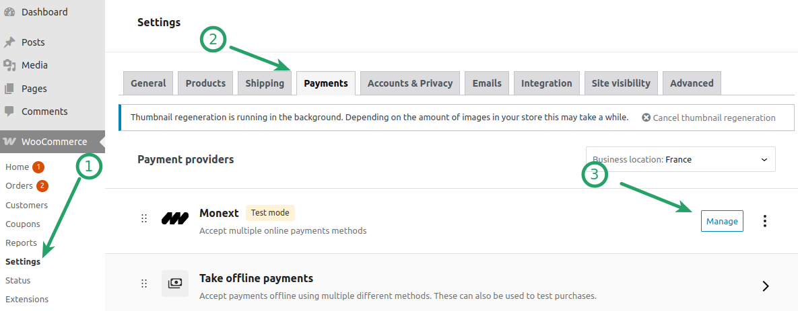
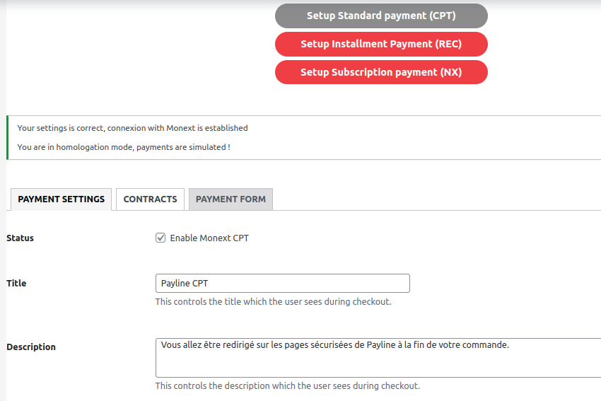
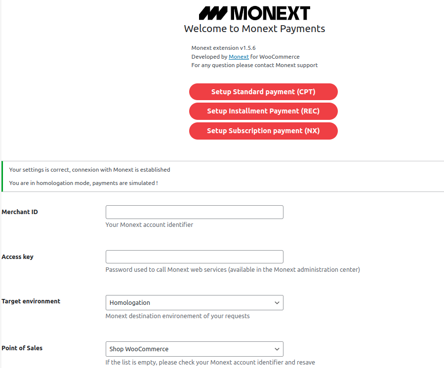
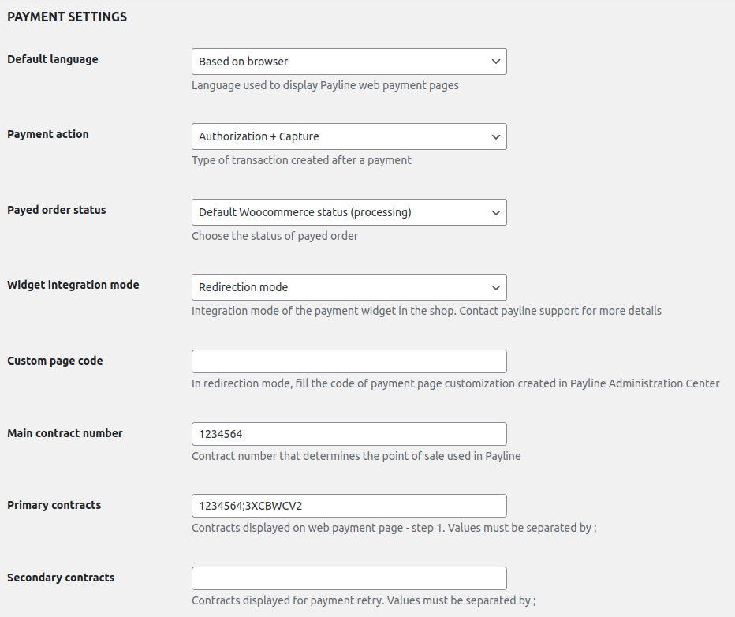

# 

# Monext Woocommerce Plugin

----

## Table of Content

* [Overview](#overview)
* [Features](#features)
* [Installation](#installation)
    * [Requirements](#requirements)
    * [Installation process](#installation-process)
* [Configuration](#configuration)
* [Additional resources for developers](#additional-resources-for-developers)
* [License](#license)
* [Contact and support](#contact-and-support)

## Overview

This plugin allows you to use the Monext payment system with a Wocommerce ecommerce application.

## Features

This plugin integrate with native Wocommerce orders' workflow and provides the following features:
It allows you to:
* Do offsite payment on a payment page hosted by Monext.
* Cancel payments.
* Refund payments.

### Supported payment methods

This plugin supports the several payment methods.
You can also check [our documentation](https://docs.monext.fr/display/DT/Payment+Method) for more information about other supported payment methods.

## Installation

### Requirements

No more requirements than Woocommerce.

### Installation process

See https://wordpress.org/documentation/article/manage-plugins/#installing-plugins-1

## Configuration

Here are the main configuration fields for the payment method:

* Base
    * Title

* Acess:
    * Merchant ID
    * Access key
    * Environment
        * Homologation for debug and test purpose.
        * Production for real payment.
        * You need to carry out 'pilot' transactions to validate that they are working properly in production.
        *

* Settings
    * Payment action
    * Widget integration mode
    * Main contract number
    * Primary contracts (Comma-separated list of your enabled Monext payment contracts that should be used.)
    * Secondary contracts (Comma-separated list of your enabled Monext payment contracts that should be used.)

## Additional resources for developers

To learn more about how the API used by the plugin and how to modify or use Woocommerce with it to fit your needs:
* [Woocommerce Plugin Monext documentation](https://docs.monext.fr/display/DT/WooCommerce+Plugin)
* [Monext API documentation](https://api-docs.retail.monext.com/reference/getting-started-with-your-api)
* [Woocommerce developer documentation](https://developer.woocommerce.com/)

## License

This plugin's source code is completely free and released under the terms of the MIT license.

## Contact and support

If you want to contact us, the best way is through [this page on our website](https://www.monext.fr/gardons-le-contact) and send us your question(s).

We guarantee that we answer as soon as we can!

If you need support you can also directly check our FAQ section and contact us [on the support page](https://support.payline.com/hc/fr).