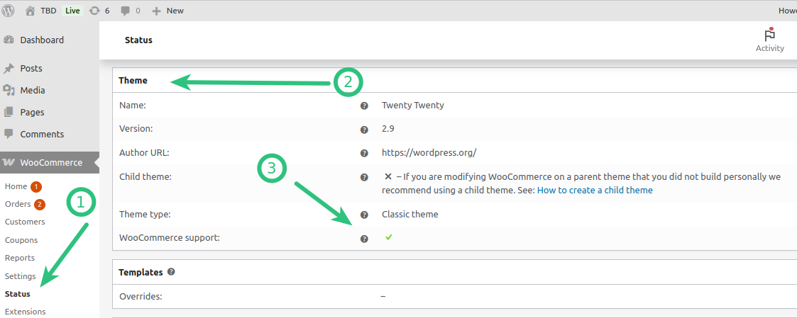
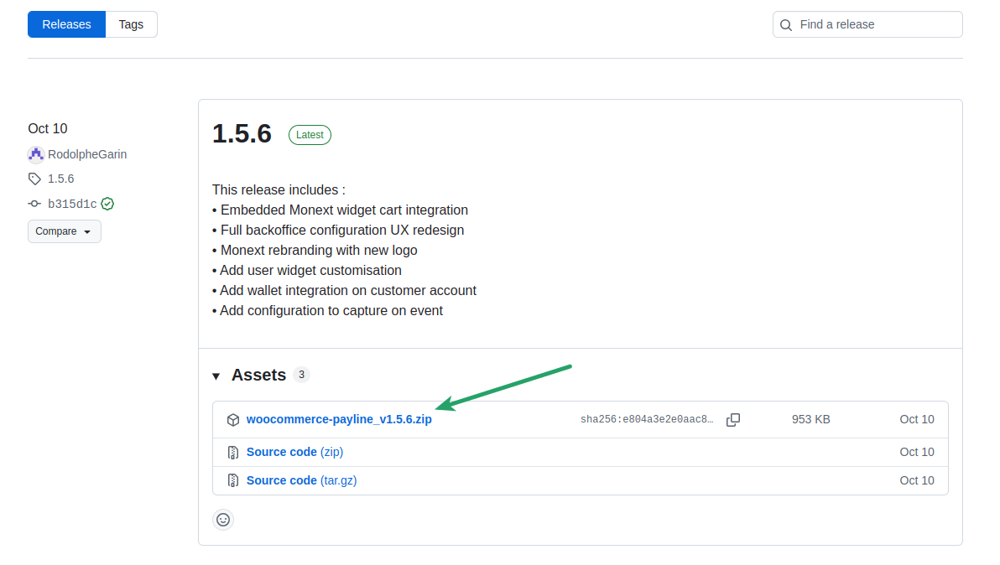
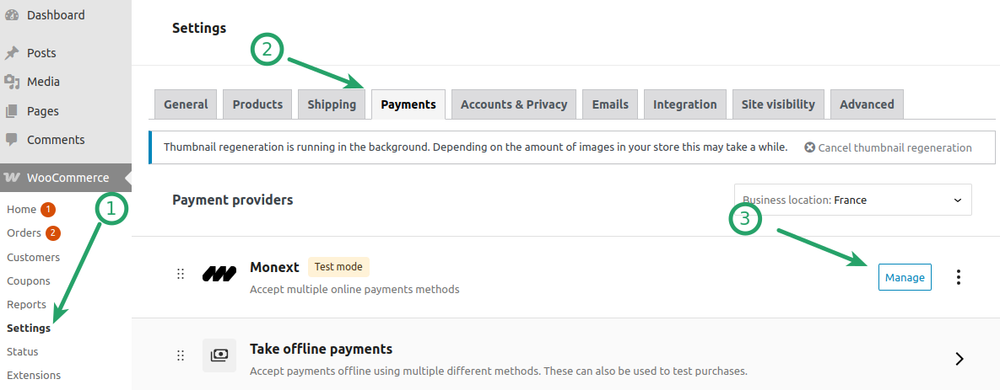
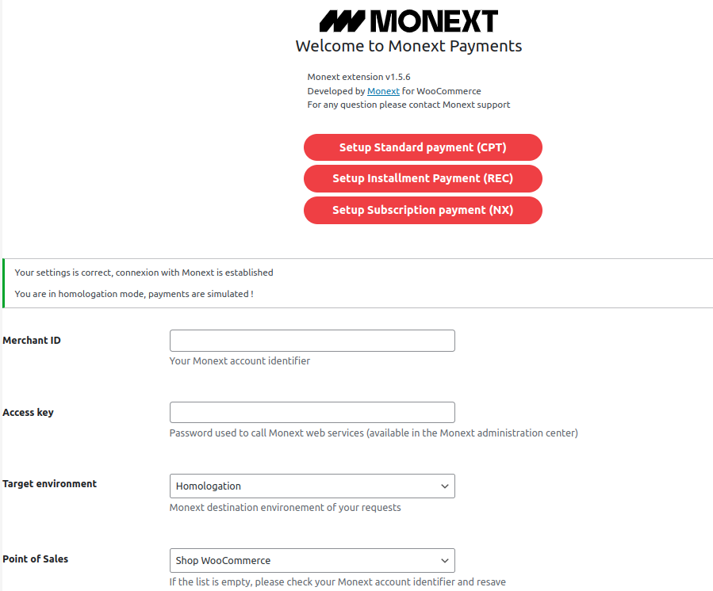
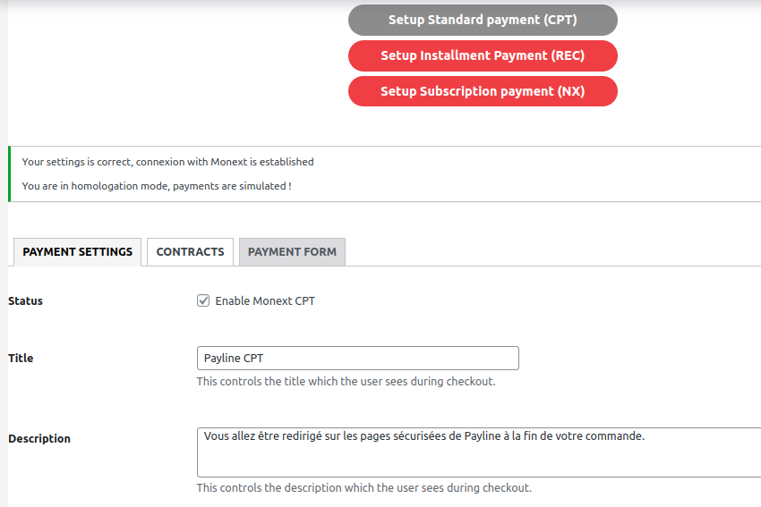
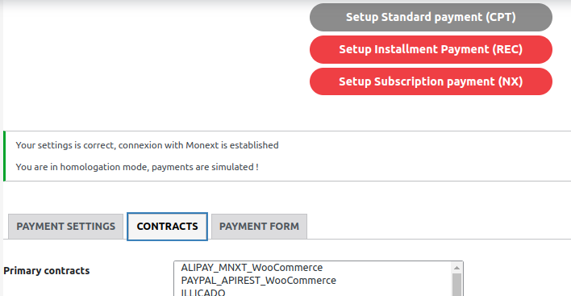
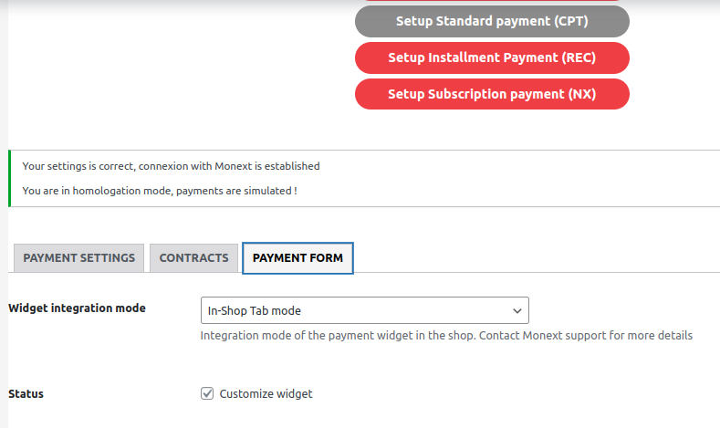

# 

# Monext Woocommerce Plugin

----

## Table of Content

* [Overview](#overview)
* [Features](#features)
* [Installation](#installation)
    * [Requirements](#requirements)
    * [Installation process](#installation-process)
* [Configuration](#configuration)
* [Additional resources for developers](#additional-resources-for-developers)
* [License](#license)
* [Contact and support](#contact-and-support)

## Overview

This plugin allows you to use the Monext payment system with a Wocommerce ecommerce application.

## Features

This plugin integrate with native Wocommerce orders' workflow and provides the following features:
It allows you to:
* Do offsite payment on a payment page hosted by Monext.
* Cancel payments.
* Refund payments.

### Supported payment methods

This plugin supports the several payment methods.
You can also check [our documentation](https://docs.monext.fr/display/DT/Payment+Method) for more information about other supported payment methods.

## Installation

### Requirements

Theme need to be fully compatible with Woocommerce (may work even if theme is flagged as "Not declared")

### Environment (Development, QA validation)
* WordPress version: 6.8.1
* WooCommerce version: 9.8.5
* php 8.4

### Installation process

You will need to download the last available released package ( **woocommerce-payline_vx.x.x.zip**
) from the [Github Releases page](https://github.com/Monext/monext-woocommerce/releases) 

See installation documentation
   * [Wordpress: Mnagae plugins](https://wordpress.org/documentation/article/manage-plugins/#upload-via-wordpress-admin)
   * [Monext: WooCommerce Plugin integration](https://docs.monext.fr/spaces/DT/pages/796335253/WooCommerce+Plugin+-+Integration)

## Configuration

Enter the Monext payment configuration 

Here are the main configuration fields for the payments methods (Standard, Installment and Subscription)

1. Set the Monext credentials
   * Merchant ID
   * Access key
   * Environment
      * Homologation for debug and test purpose.
      * Production for real payment.
   * Point of Sales (will be filled after the first save)
     
You need to carry out 'pilot' transactions to validate that they are working properly in production.

2. Define specific settings
   * Payment settings
   * Contracts
   * Payment form (allow widget personalization, only for standard payment)
   

## Additional resources for developers

To learn more about how the API used by the plugin and how to modify or use Woocommerce with it to fit your needs:
* [Woocommerce Plugin Monext documentation](https://docs.monext.fr/display/DT/WooCommerce+Plugin)
* [Monext API documentation](https://api-docs.retail.monext.com/reference/getting-started-with-your-api)
* [Woocommerce developer documentation](https://developer.woocommerce.com/)

## License

This plugin's source code is completely free and released under the terms of the MIT license.

## Contact and support

If you want to contact us, the best way is through [this page on our website](https://www.monext.fr/gardons-le-contact) and send us your question(s).

We guarantee that we answer as soon as we can!

If you need support you can also directly check our FAQ section and contact us [on the support page](https://support.payline.com/hc/fr).